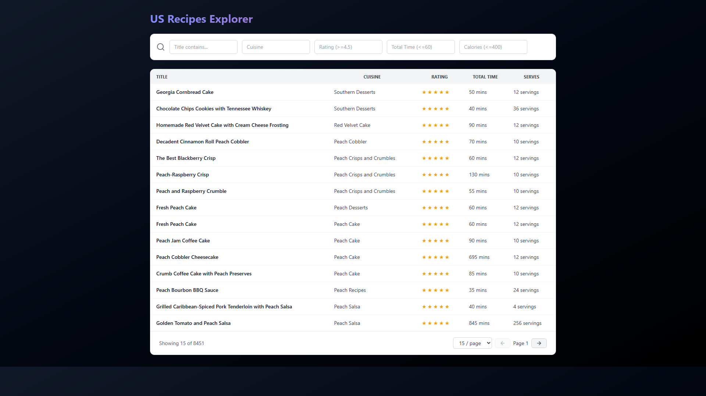
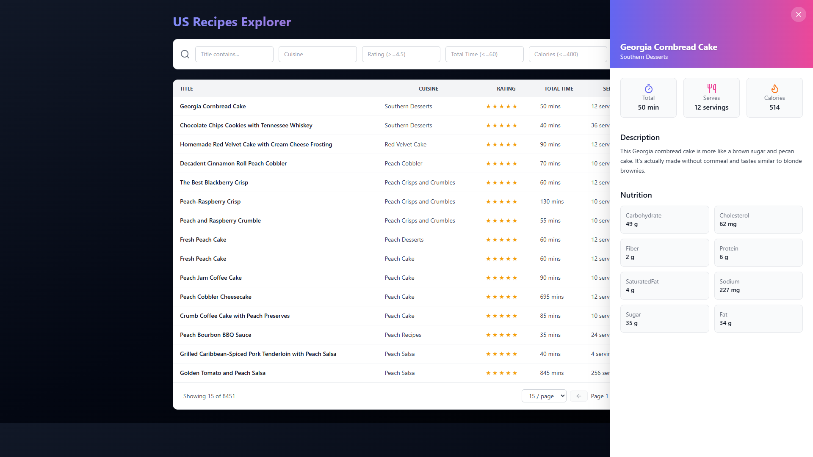
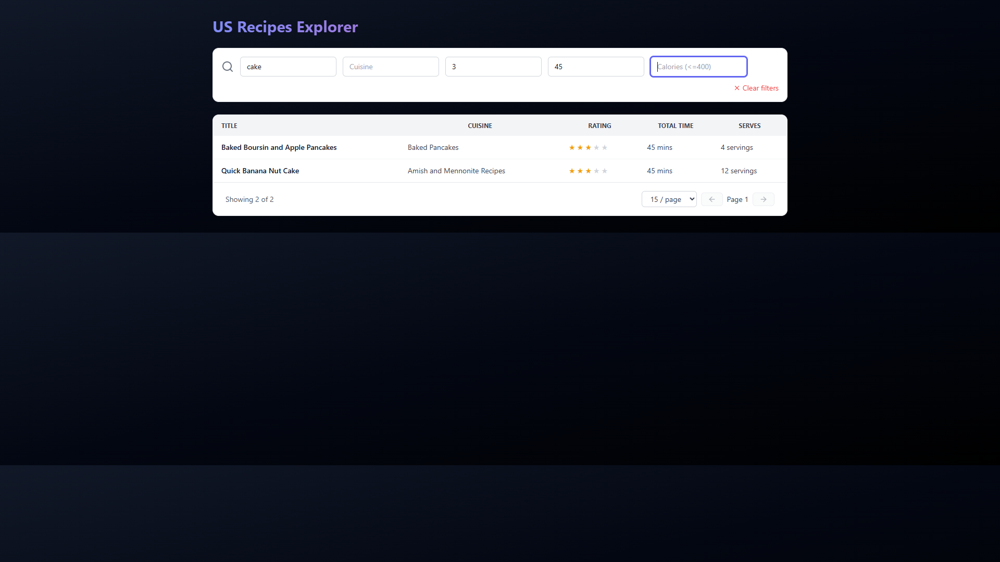
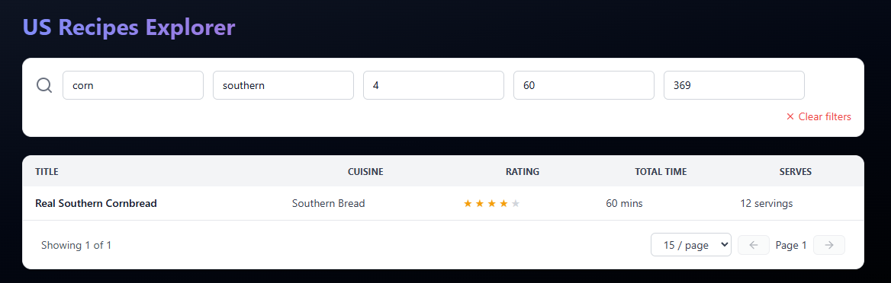
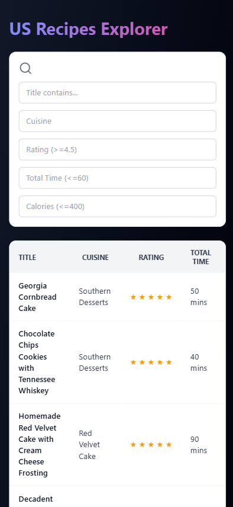
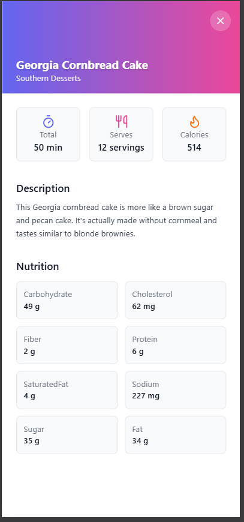
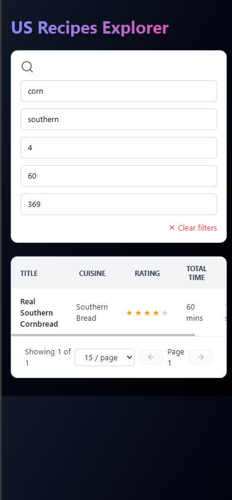

# 🍴 US Recipes Explorer

Discover and explore a collection of US recipes with a clean, modern interface.
Search, filter, and view detailed nutrition facts — all powered by a fast Node.js + SQLite backend and a sleek React (Vite) frontend.

---

## 🚀 Features

- 🔍 **Smart Search & Filters** — find recipes by title, cuisine, rating, total time, and calories.
- 📊 **Pagination Controls** — smooth navigation with adjustable page size.
- 🥗 **Detailed Recipe Drawer** — slide-in panel with description, quick facts, and nutrition breakdown.
- 📱 **Responsive Design** — optimized for mobile, tablet, and desktop.
- 🎨 **Modern Bright Theme** — minimal, vibrant UI with animations.

---

## 🛠️ Tech Stack

**Frontend**
- React (Vite) ⚡
- TailwindCSS 🎨
- Framer Motion ✨
- Lucide Icons

**Backend**
- Node.js + Express 🚀
- SQLite3 (seeded from `US_recipes.json`) 🗄️


## 📂 Project Structure

```

recipes-assessment/
├── client/          # Frontend (Vite + React)
│   ├── src/
│   │   ├── components/   # Drawer, Table, StarRating
│   │   └── App.jsx
│   └── vite.config.js
│
├── server/          # Backend (Node + Express + SQLite)
│   ├── db.js
│   ├── index.js     # Express API
│   ├── seed.js      # Seeds DB from US\_recipes.json
│   └── US\_recipes.json
│
└── README.md

````

---

## ⚙️ Installation & Setup

### 1. Clone the repo

```bash
git clone https://github.com/subbareddy999/US-Recipes-Explorer.git
cd recipes-assessment
````

### 2. Backend Setup

```bash
cd server
npm install
npm run seed   # seeds database from US_recipes.json
npm start      # runs backend at http://localhost:5000
```

### 3. Frontend Setup

```bash
cd ../client
npm install
npm run dev    # runs frontend at http://localhost:5173
```

---

## 🌐 API Endpoints

| Method | Endpoint                  | Description                 |
| ------ | ------------------------- | --------------------------- |
| GET    | `/api/recipes`            | Paginated list of recipes   |
| GET    | `/api/recipes/:id`        | Single recipe by ID         |
| GET    | `/api/recipes/search?...` | Search recipes with filters |

---

## 📸 Screenshots

### 🖥️ Desktop

- **Home / Table View**
  
- **Recipe Drawer**
  
- **Search Results**
  
- **Search Results (Filtered)**
  

### 📱 Mobile

- **Mobile Home**
  
- **Mobile Recipe Drawer**
  
- **Mobile Search**
  

---

## ✅ Deliverables

- Backend API with SQLite
- Database seeded from `US_recipes.json`
- React frontend with filters, pagination, drawer
- Responsive modern UI

---

## 👨‍💻 Author

Developed by subbareddy_k,
Assignment submission for **Securin**
